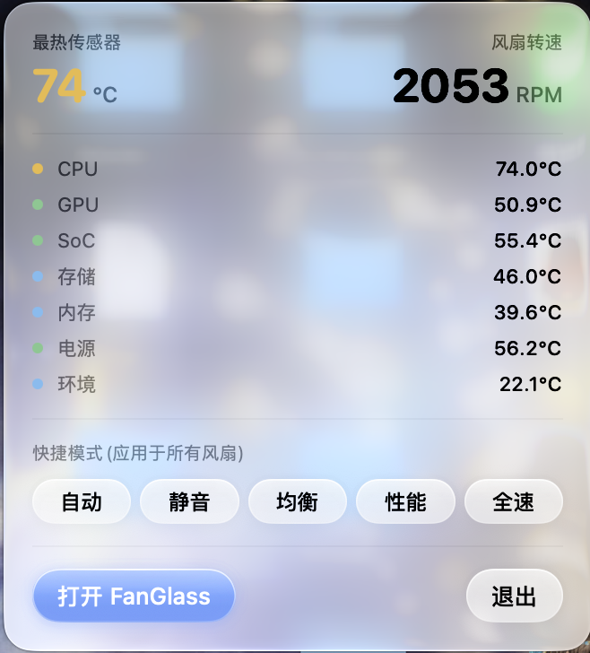

[中文](README.md) | [English](README.en.md)

# FanGlass

液态玻璃风格的 macOS 风扇控制软件，原生 SwiftUI 实现，零第三方依赖。

  

**仅支持 Apple Silicon（M1 及更新机型）**，暂不支持 Intel Mac（原因见[支持的设备](#支持的设备)）。

<p align="center">
  
</p>

<p align="center"><sub>菜单栏面板：最热传感器温度、风扇转速、各组温度与快捷模式</sub></p>

## 功能

- **菜单栏常驻**：状态栏图标旁实时显示最热传感器温度；点开玻璃面板可看各组温度、风扇转速，并一键切换快捷模式（自动 / 静音 / 均衡 / 性能 / 全速），**当前生效的模式会高亮**
- **每个风扇独立配置**：自动 / 固定转速 / 曲线三种模式，多风扇机型逐个设置
- **风扇曲线编辑器**：2–8 个可拖拽控制点，单调三次（PCHIP）插值保证曲线不回头；双击空白添加控制点，右键删除；横轴温度、纵轴转速百分比（同时标注实际 RPM），并实时标出当前工作点
- **曲线预设**：静音 / 均衡 / 性能 / 全速，选中的预设会高亮；手动拖动控制点后标记为「自定义」
- **传感器仪表盘**：启动时扫描 SMC 全部温度键，按 CPU / GPU / 内存 / 电源 / 系统 / 环境 / 其他分组，实时数值 + 历史趋势图
- **过热提醒**：任一传感器（环境除外）超过阈值时发送系统通知，阈值可调、可关闭
- **转速迟滞**：0–400 RPM 可调，避免转速在边界值附近反复抖动
- **状态从不撒谎**：助手未安装 / 版本过旧、SMC 写入被拒、传感器读取失败等情况都会在界面上明确说出来，而不是装作一切正常
- **持久化**：配置存于 `~/Library/Application Support/FanGlass/settings.json`

## 安装

**要求**：Apple Silicon Mac，macOS 15 或更高版本（顶栏的液态玻璃材质需要 macOS 26，在更低版本上自动回退为系统材质）。

### 一、下载安装

1. 从 [Releases](../../releases) 下载 `FanGlass.app.zip` 并解压。
2. 把 `FanGlass.app` 拖进「应用程序」文件夹。
3. 双击打开。本应用使用 ad-hoc 签名（没有 Apple 开发者证书），首次打开会被 Gatekeeper 拦截，二选一：
   - 打开**系统设置 → 隐私与安全性**，滚动到底部的**安全性**一栏，找到被拦截的 FanGlass，点**仍要打开**，再确认一次**打开**；
   - 或者在终端里去掉隔离标记：

     ```bash
     xattr -dr com.apple.quarantine /Applications/FanGlass.app
     ```

   > 早期 macOS 上的「右键 → 打开」在 macOS 15 之后已不再能绕过拦截，请使用上面两种方式之一。自己从源码编译出来的 App 不带隔离标记，不会遇到这一步。

4. 首次启动时，FanGlass 会弹出一次授权提示：

   > **FanGlass 需要一次管理员授权**
   > 风扇转速的写入需要 root 权限。FanGlass 会安装一个后台助手来完成写入，只需授权一次，之后无需再输入密码。温度读取不需要任何权限。

   点**安装助手**并输入登录密码。装好后窗口右上角的状态标记会变成「助手已连接」，就可以开始调风扇了。

如果当时点了**稍后**也没关系 —— 之后任何时候选择「固定转速」、曲线预设或菜单栏的快捷模式，FanGlass 都会就地再问一次，不需要你去设置里找。菜单栏面板和风扇页也各有一个「安装助手」按钮。

### 二、从源码编译

需要 Xcode Command Line Tools（`xcode-select --install`），**不需要**完整 Xcode，也没有 Xcode 工程文件 —— 直接用 `swiftc` 编译，约 15 秒：

```bash
git clone https://github.com/sganggs/FanGlass.git
cd FanGlass
./scripts/build.sh      # 编译 App + 助手，组装 build/FanGlass.app（ad-hoc 签名）
open build/FanGlass.app # 或 ./scripts/run.sh（编译并启动）
```

也可以不开界面直接装助手：`./scripts/install.sh`（同样弹一次管理员授权）。

## 使用

- **菜单栏**：图标旁是当前最热的传感器温度。点开面板可看各组温度和风扇转速，底部一排快捷模式**应用于所有风扇**；当前模式高亮，如果各风扇设置不同或处于自定义曲线 / 固定转速，面板会用一行小字说明。
- **仪表盘**：传感器分组卡片 + 历史趋势图，标题旁标出本机探测到的探头数量。
- **风扇控制**：每个风扇一张卡片，显示实时转速、硬件转速范围和「手动控制中」标记。
  - **自动**：交还 macOS 管理，不需要助手。
  - **固定转速**：滑杆按百分比在 `F{i}Mn..F{i}Mx` 之间取目标值，松手时立即下发。
  - **曲线**：先选一个预设，再直接在图上拖控制点；双击空白添加、右键删除（最少 2 个、最多 8 个）。曲线跟随的温度源在设置里选（默认 CPU，可改为最热传感器）。
- **设置**：采样间隔（0.5–3 秒）、登录时启动、退出时是否立即恢复自动、曲线温度源、转速迟滞、过热提醒阈值，以及特权助手的安装 / 重新安装 / 卸载。

## 支持的设备

只有一台机器经过真机验证：**Mac16,10（M4，单风扇），macOS 27.0（26A428）**。其余机型的键表来自公开资料并已写进代码，但**没有在真机上跑过**，下表如实标注。

| 机型 | 传感器读取 | 风扇控制 | 说明 |
|---|---|---|---|
| M1 / M1 Pro / Max / Ultra | 预期可用 | 预期可用 | CPU 为 `Tp*`、GPU 为 `Tg*`；未实测 |
| M2 全系 | 预期可用 | 预期可用 | 同上；未实测 |
| M3 全系 | 预期可用 | 预期可用 | 该代 CPU 为 `Tf0*`/`Tf4*`、GPU 为 `Tf1*`/`Tf2*`，已单独适配；未实测 |
| M4 全系 | ✅ 实测 | ✅ 实测 | 开发与验证机型（Mac16,10） |
| M5 及更新 | 预期可用 | 预期可用 | 按 SMC 键前缀分组；若这一代换了键名族，未识别的传感器会落入「其他」，欢迎提交 `probe` 输出 |
| 无风扇机型（MacBook Air 等） | 预期可用 | — | 仅显示传感器；界面会明确提示「本机无可控风扇」 |
| 多风扇机型（14/16″ MBP、Mac Studio、Mac Pro） | 预期可用 | 预期可用 | 每个风扇独立配置，菜单栏显示最高转速与风扇数量；未实测 |
| Intel Mac | ❌ | ❌ | 见下 |

**关于 Intel Mac**：发布的构建只有 arm64 一个切片，在 Intel 机器上无法运行。代码里确实写了 Intel 需要的那一套（`sp78`/`fpe2` 大端定点解码、`TC0*`/`TCA*`/`TG0*` 分组、没有 `F{i}Md` 时改用 `FS!` 位掩码强制转速），`FANGLASS_ARCHS="arm64 x86_64" ./scripts/build.sh` 也能编出通用二进制，但这条路径**从未在任何 Intel 真机上验证过**，因此不作为支持的配置。有 Intel 设备的开发者欢迎提 PR 或 issue。

**如果你的机型分组不对**：`tools/probe.swift` 会只读地导出本机全部 SMC 键、类型与解码值，把输出贴到 issue 里就能帮助补上这一代的键表：

```bash
swiftc -O -o build/probe tools/probe.swift Sources/Shared/SMC.swift -framework IOKit
./build/probe          # 全部键；./build/probe T 只看温度键
```

它只读取、从不写入，也不需要任何权限。

## 工作原理与安全机制

```
FanGlass.app（SwiftUI 菜单栏程序，普通用户权限）
   │  读取 SMC：温度 / 转速 / 风扇硬件范围（IOKit AppleSMC，无需任何权限）
   │  JSON-lines over /var/run/fanglass.sock（每 5 秒一次心跳）
   ▼
fanglass-helper（launchd root 守护进程，协议 v5）
   │  写入 SMC：F{i}Md 手动模式 + F{i}Tg 目标转速（老机型走 FS! 位掩码）
   │  每 1 秒重新断言一次（macOS 会周期性夺回风扇控制权）
   ▼
AppleSMC
```

读温度不需要任何权限；**写风扇寄存器只有 root 能做**，非 root 进程写 `F0Md` / `F0Tg` 会被内核以 `kIOReturnNotPrivileged` 拒绝。这就是助手存在的唯一理由，也是那一次管理员授权无法省略的原因。

**这个助手是一个以 root 运行的守护进程**，通过 Unix 域套接字接受指令 —— 开源软件里放这样一个东西，应该把边界说清楚：

- **谁能指挥它**：每个连接都用 `LOCAL_PEERCRED` 校验对端 uid，只接受 root 和当前坐在这台 Mac 前的登录用户；其它本地进程一律拒绝（拒绝日志限流，避免被刷）。
- **它能做什么**：只有风扇相关的 SMC 写入，没有别的特权操作。目标转速永远被钳制在该风扇自己上报的硬件范围 `F{i}Mn..F{i}Mx` 内，无法超转。
- **App 失联 20 秒** → 看门狗把所有风扇交还系统自动控制（睡眠唤醒造成的时钟跳变不算失联；`kill -9` 已实测可恢复）。
- **收到 SIGTERM / SIGINT**（卸载、重启、`launchctl bootout`）→ 先恢复自动再退出。
- **连续约 10 秒写入失败** → 重开 IOKit 连接，仍失败就交还系统，而不是对着不听话的硬件一直硬写。
- **传感器读不出来时** → 不会把读取失败当成 0 °C 去下发最低转速，而是交还系统控制并在界面上说明。
- **正常退出 App**（⌘Q / 菜单栏退出）→ 立即恢复自动，可在设置中关闭；关闭后也只是延后到助手 20 秒后接管，不存在「退出后永久保持当前转速」。
- **安装过程**：特权脚本不落盘，作为参数传给 `osascript`；授权前后各校验一次文件的 sha256，堵住「暂存到获得 root 之间被换掉」的窗口。助手日志写在 `/var/log/fanglass-helper.log`，并安装 `newsyslog` 轮转规则，卸载时一并删除。

**为什么不用 SMAppService / SMJobBless？** 这两条路都要求 App 有稳定的 Apple 开发者签名身份，ad-hoc 签名的构建会被直接拒绝；`SMAppService.daemon` 注册后用户还要再去**系统设置 → 登录项与扩展**里手动允许一次，并且它记录的是 App 包内的相对路径，把 App 挪个位置就失效。相比之下，当前做法是：一次管理员授权，把助手复制到 `/Library/PrivilegedHelperTools`，此后 App 放在哪、更新还是删除都不影响它。

## 卸载

1. 打开 FanGlass → **设置 → 特权助手 → 卸载助手…**（需要再授权一次），或在终端执行 `./scripts/uninstall.sh`。
2. 把 `FanGlass.app` 拖进废纸篓。
3. 如需清掉配置：`rm -rf ~/Library/Application\ Support/FanGlass`。

卸载会移除 `/Library/LaunchDaemons/com.fanglass.helper.plist`、`/Library/PrivilegedHelperTools/fanglass-helper`、套接字、日志及其轮转规则。卸载前助手会先收到 SIGTERM，把风扇交还系统自动控制。

## 常见问题

**为什么一定要输一次密码？**
macOS 只允许 root 进程写 SMC 的风扇寄存器。任何能控制 Mac 风扇的软件都必须跨过这条线，绕不过去。FanGlass 只在安装助手时问一次，之后不再打扰你。

**如果我只是删掉 App，不卸载助手呢？**
助手在 20 秒内收不到心跳就会把所有风扇交还系统自动控制，不会有风扇被卡在某个转速。但守护进程本身还装在系统里，想彻底清掉请按上面的卸载步骤来。

**把 App 从桌面挪到「应用程序」、或者更新一版，会不会把助手搞坏？**
不会。助手是复制到 `/Library/PrivilegedHelperTools` 的独立文件，与 App 的位置无关。

**状态显示「助手版本过旧」？**
launchd 会一直运行磁盘上那一份旧守护进程，新版 App 的指令它可能不认。点一下那个状态标记（或到设置里点「更新助手…」）重装一次即可，只需再授权一次。

**风扇页提示「此机型暂不支持风扇控制」？**
说明这台 Mac 的 SMC 没有提供可写入的转速目标或手动模式开关（无风扇机型，或该机型只读暴露风扇）。传感器部分仍然可以正常使用。

**「登录时启动」打不开？**
该开关走系统的 `SMAppService`，ad-hoc 签名的构建有可能被系统拒绝注册。这种情况下可以改用「系统设置 → 通用 → 登录项」手动添加 FanGlass。

**界面能切英文吗？**
目前界面只有简体中文，英文本地化还没做（欢迎 PR）。

## 液态玻璃设计

设计手法是「玻璃在边缘，不在背景」（参考 macOS Tahoe / visionOS 的质感）：

- 纯色基底：冷灰蓝 ±2% 明度微渐变，干净但不死平；顶部一盏**静止的**白色摄影棚灯，所有玻璃表面的高光都与它呼应
- 玻璃卡片：白色半透明填充 + 顶部镜面高光 + 1px 渐变发丝描边 + 双层投影（接触 / 环境）
- 顶栏在 macOS 26 上使用系统的 Liquid Glass 材质，卡片滚到下面时会被真实折射模糊；更低版本回退为系统材质
- 顶部 3px 氛围灯带：唯一随温度变色的装饰（蓝 → 绿 → 橙 → 红），既是点缀也是状态指示
- 交互动效：按钮按压 spring 缩放、卡片 hover 描边提亮、分段控件玻璃 pill 滑动、顶栏风扇图标按真实 RPM 旋转
- 选中态用的是强调色描边 + 淡填充（「强调边缘」而不是整块涂色），与 prominent 主按钮明确区分
- 温度数字按档位变色（<50 蓝 / <70 绿 / <85 橙 / 更高 红）

## 贡献

最需要的是**真机覆盖**：除 M4 外的机型都没有实测过。如果你手上有别的 Mac，跑一下只读的 SMC 探针并把输出贴进 issue，就是最直接的帮助：

```bash
swiftc -O -o build/probe tools/probe.swift Sources/Shared/SMC.swift -framework IOKit
./build/probe
sysctl -n hw.model
```

`tools/probe.swift` 只读取 SMC，永远不写入，也不需要 root。

代码约定：

- 界面文案为简体中文，代码注释为英文。
- 源码目录：`Sources/FanGlass`（App）、`Sources/HelperTool`（root 守护进程）、`Sources/Shared`（SMC 访问与协议，两端共用）。
- 没有 Xcode 工程，`scripts/build.sh` 直接调 `swiftc`；改完跑一遍它就行。
- `build.sh` 在签名前会执行 `xattr -cr`：源码放在桌面或 iCloud 同步目录时，bundle 上会带 `com.apple.FinderInfo`，`codesign` 会以 “resource fork, Finder information, or similar detritus not allowed” 失败，而没签好的包在下载者那边会被 Gatekeeper 报成「已损坏」。
- 改动助手的通信协议时，记得同步提升 `Sources/Shared/HelperProtocol.swift` 里的 `version`，否则用户机上那份旧守护进程会静默忽略新指令。

## 许可证

[MIT](LICENSE) © 2026 Ausevay
